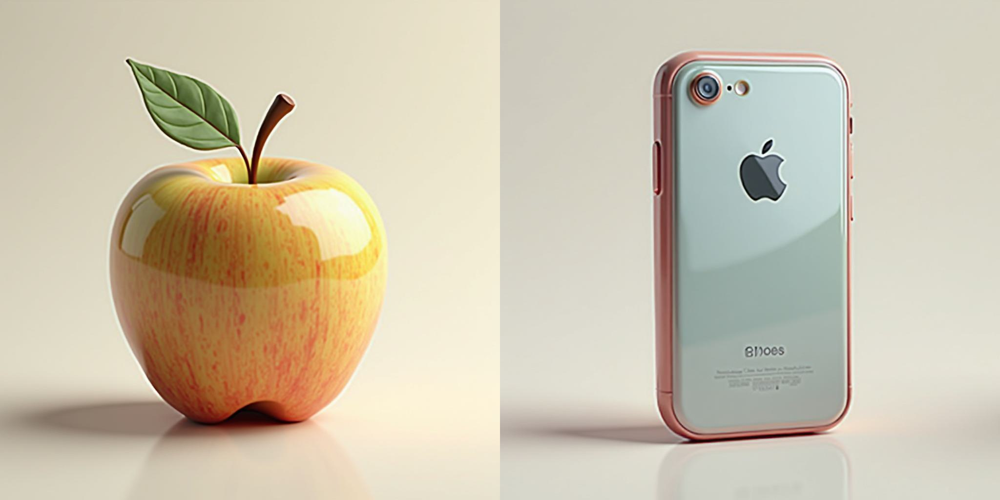

环境: RTX 5090 32G

1024分辨率可以一次跑两个prompts

展示：
 

提示词为`{"Globe in 3D realism style.", "iPhone in 3D realism style."}`

 

提示词为`{"Apple in 3D realism style.", "iPhone in 3D realism style."}`


<div align="center">

# [NIPS 2025🔥] AlignedGen: Aligning Style Across Generated Images

[](https://jiexuanz.github.io/AlignedGen/)
[](https://arxiv.org/abs/2509.17088 )

Jiexuan Zhang, Yiheng Du, [Qian Wang](https://akaneqwq.github.io/), Yu
Gu, [Weiqi Li](https://scholar.google.com/citations?user=SIkQdEsAAAAJ), [Jian Zhang](https://jianzhang.tech/)

School of Electronic and Computer Engineering, Peking University

</div>

----

## 🔥 Introduction


AlignedGen generates a set of images with a consistent style from a set of prompts.

For example, given the prompts: `{Anchor, Clock, Globe, Bicycle} in 3D realism style.`, AlignedGen will produce the results shown below. For more details on how to run the model, please see the [Inference section](#-inference). Additional examples are available on our [project website](https://jiexuanz.github.io/AlignedGen/).

##  


## 🚩 News

- 09.23 Released paper and code.

## 🔧 Dependencies and Installation

```bash
conda create -n aligned python=3.10
conda activate aligned
conda install pytorch==2.5.1 torchvision==0.20.1 torchaudio==2.5.1 -c pytorch
pip install diffusers transformers sentencepiece protobuf==3.19.0
```

## ⚡ Inference

Before running, please ensure FLUX.1-dev model is accessible to the script.
Then, run the inference script with the following command:

```
python inference.py --model_path black-forest-labs/FLUX.1-dev --style_lambda 1.1
```

This will generate the image shown at the beginning of this README.

**Note on VRAM**: If you encounter out-of-memory errors, try reducing the number of prompts or enabling the offload option within the pipeline.

## 📊 Compare With Other Methods

##  


## 🌟 User-Provided Image As Style Reference

##  

## 🤔 Control & DreamBooth

<div align="center">
  
</div>
<div align="center">
  
</div>

## ✏️ To Do List

- [x] Release the paper and code
- [ ] Release ControlNet Code
- [ ] Release DreamBooth Code
- [ ] Release Attention Map Visualization Code
- [ ] Release User-Provided Image As Style Inference Code
- [ ] Support Qwen-Image
- [ ] Support ComfyUI
- [ ] Support Gradio demo

## Acknowledgement

We appreciate the releasing codes of [StyleAligned](https://github.com/google/style-aligned)
and [Diffusers](https://github.com/huggingface/diffusers).

## Citation

If our work assists your research, feel free to give us a star ⭐ or cite us using:

```
@article{zhang2025alignedgen,
  title={AlignedGen: Aligning Style Across Generated Images},
  author={Zhang, Jiexuan and Du, Yiheng and Wang, Qian and Li, Weiqi and Gu, Yu and Zhang, Jian},
  journal={arXiv preprint arXiv:2509.17088},
  year={2025}
}
```

[//]: # ()
[//]: # (---)

[//]: # (## ⭐️ Star History)

[//]: # ()
[//]: # ([![Star History Chart]&#40;https://api.star-history.com/svg?repos=Jiexuanz/AlignedGen&type=Date&#41;]&#40;https://www.star-history.com/#Jiexuanz/AlignedGen&Date&#41;)

[//]: # ()

